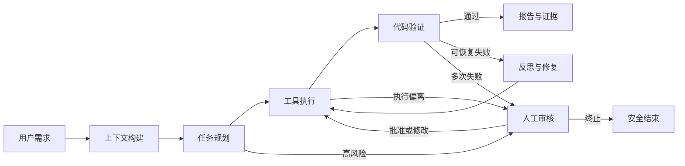
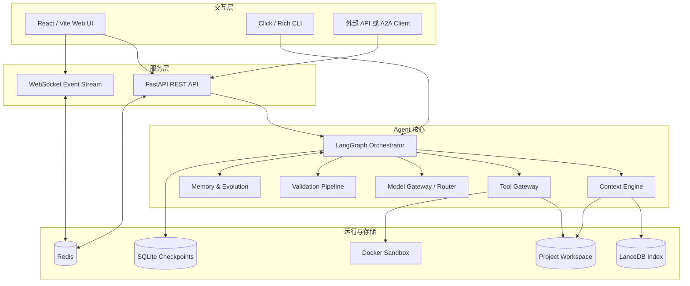

<div align="center">
  
  <h1>CodeAgent</h1>
  <p><strong>面向真实代码仓库、可验证且可追踪的软件工程 Agent</strong></p>
  <p>
    从需求理解、代码检索、计划生成和文件修改，到测试验证、人工审核与结果报告，
    CodeAgent 提供一条完整的 Web-first 自动化开发链路。
  </p>

  <p>
    <a href="https://github.com/wee235929-cmyk/Codeagent/actions/workflows/ci.yml"></a>
    <a href="https://github.com/wee235929-cmyk/Codeagent/actions/workflows/security.yml"></a>
    
    
    <a href="LICENSE"></a>
  </p>

  <p>
    <a href="#quick-start">快速开始</a> ·
    <a href="#features">核心能力</a> ·
    <a href="#architecture">系统架构</a> ·
    <a href="#configuration">配置说明</a> ·
    <a href="#development">开发与验证</a> ·
    <a href="#documentation">相关文档</a>
  </p>
</div>

> [!IMPORTANT]
> CodeAgent 当前版本为 `0.1.0`，仍处于积极开发阶段。建议先在测试仓库或独立 Git 分支中使用，并在合并前人工检查代码差异与验证结果。

**English summary:** CodeAgent is a Web-first software-engineering agent that plans, explores, edits, validates, and reports changes against a real repository through bounded tools.

## ✨ 项目简介

CodeAgent 不只生成一段代码或一条模型回复，而是围绕一个真实项目执行完整的软件工程任务：

1. 理解用户需求并加载项目级指令；
2. 使用文件树、关键词、符号、依赖和语义检索定位相关代码；
3. 生成可执行计划，并根据风险决定是否请求人工确认；
4. 通过受约束工具读取、修改文件和运行命令；
5. 执行语法、静态分析、测试或运行时验证；
6. 在失败时分析原因、重试或进入人工审核；
7. 通过 WebSocket 实时展示过程，并保存最终报告、差异和验证证据。

项目默认提供 React Web 界面，同时保留 CLI、REST API、WebSocket、MCP 和 A2A 1.0 接入能力，适合本地开发、能力研究和工程集成。

<a id="features"></a>

## 🚀 核心能力

| 能力 | 说明 |
| --- | --- |
| Agent 工作流 | 基于 LangGraph 串联上下文、规划、执行、验证、反思、审核与重试节点 |
| 混合代码检索 | 组合受限 `ripgrep`、Tree-sitter 符号/依赖分析、LanceDB 语义检索和紧凑的 Explore 结果融合 |
| 工程工具集 | 文件列表/读写/删除、冲突感知补丁、正则搜索、Git、符号定义/引用导航、诊断与终端执行 |
| 安全执行 | 将路径限制在目标项目内，提供命令安全检查、超时、输出限制和可选 Docker 沙箱 |
| 实时交互 | Redis 事件历史 + Pub/Sub，通过 WebSocket 推送计划、工具调用、恢复、审核和完成事件 |
| 人工介入 | 高风险计划、执行偏离或验证失败时可暂停，支持批准、终止、修改和运行中 steering |
| 项目记忆 | 保存会话轨迹，提取可复用策略，并按项目召回历史经验 |
| 项目扩展 | 自动读取 `AGENTS.md`、`.codeagent/skills/*/SKILL.md`，支持 MCP stdio / Streamable HTTP 工具 |
| 模型可靠性 | LiteLLM 多提供商接入、三级模型路由、分类重试、`Retry-After`、熔断和显式备用模型 |
| 可观测性 | 结构化日志、Prometheus 指标、可选 OpenTelemetry / Jaeger，以及持久化任务报告 |
| SWE 评测 | 内置 30 条 SWE-bench Lite smoke catalog，并提供预测导出和官方 Docker Harness 对接流程 |

## 🧭 工作流程



一次正常任务会获得隔离的、可写的项目工作区。Web 页面持续展示真实事件时间线；任务完成后，可以查看最终回复、修改文件、仓库差异和验证证据。只有模型文本、没有验证证据的运行，不应被视为成功的软件工程任务。

<a id="quick-start"></a>

## ⚡ 快速开始

### 1. 环境要求

当前仓库在 Windows 上以 [Harness](scripts/harness.ps1) 作为唯一受支持的本地开发入口。

| 依赖 | 最低版本或要求 | 用途 |
| --- | --- | --- |
| Windows | Windows 10/11 + PowerShell | 运行统一 Harness |
| Python | 3.12+ | 后端、Agent 与测试 |
| Node.js | 20+，包含 npm | React 前端 |
| Git | 可用版本 | 仓库操作与差异检查 |
| Docker Desktop | Docker daemon 正常运行 | Redis 与默认执行沙箱 |
| LLM API Key | 仅真实 Agent / SWE 推理需要 | 调用所配置的模型服务 |

`setup` 会在缺少 `uv` 时自动通过 Python 安装，并根据 `uv.lock` 与 `frontend/package-lock.json` 安装锁定依赖。

### 2. 获取代码并配置模型

```powershell
git clone https://github.com/wee235929-cmyk/Codeagent.git
Set-Location Codeagent

Copy-Item .env.example .env
```

打开 `.env`，至少确认以下三项：

```dotenv
LLM_API_KEY=your-api-key
LLM_API_BASE=https://api.deepseek.com/v1
LLM_MODEL=deepseek/deepseek-v4-flash
```

模型名称采用 LiteLLM 格式。项目也可以接入其他 LiteLLM 支持的提供商；请同时修改模型名、API 地址和密钥。

> [!CAUTION]
> `.env` 只用于本地保存密钥，已被 Git 忽略。不要把真实密钥写入任务描述、日志、截图或提交记录。

### 3. 安装、检查并启动

```powershell
# 安装后端与前端依赖
powershell -ExecutionPolicy Bypass -File scripts/harness.ps1 setup

# 检查 Git、Python、Node、Docker 和上下文检索能力
powershell -ExecutionPolicy Bypass -File scripts/harness.ps1 doctor

# .env.example 默认 SANDBOX_ENABLED=true；首次运行真实 Agent 前构建沙箱镜像
powershell -ExecutionPolicy Bypass -File scripts/harness.ps1 sandbox-build

# 启动 Redis、FastAPI 和 Vite（本地默认使用 inline runner）
powershell -ExecutionPolicy Bypass -File scripts/harness.ps1 up
```

启动后可访问：

- Web UI：<http://127.0.0.1:5173>
- API：<http://127.0.0.1:8000>
- Swagger / OpenAPI：<http://127.0.0.1:8000/docs>
- 健康检查：<http://127.0.0.1:8000/health>
- Prometheus 指标：<http://127.0.0.1:8000/metrics>

### 4. 创建第一个任务

1. 打开 Web UI，在 **AGENT4CODE** 对话框中描述需求；普通对话不要求手动填写项目路径。
2. 如需跨对话共享上传文件和生成文件，可先创建持久项目；选择 **SWE Smoke** 条目时，系统会自动准备其固定版本仓库。
3. 启动任务并观察计划、检索、工具调用、验证与审核事件。
4. 完成后检查最终报告和仓库差异，再决定是否保留修改。

一些更容易执行的任务描述示例：

```text
修复登录接口在 token 过期时返回 500 的问题，补充回归测试，并运行相关测试验证。
```

```text
为用户列表 API 增加分页参数，保持现有响应字段兼容，同时更新前端类型和接口文档。
```

### 5. 管理本地服务

```powershell
# 查看服务状态
powershell -ExecutionPolicy Bypass -File scripts/harness.ps1 status

# 查看日志；参数可选 api、frontend 或 redis
powershell -ExecutionPolicy Bypass -File scripts/harness.ps1 logs api

# 停止本地服务和 CodeAgent 管理的沙箱容器
powershell -ExecutionPolicy Bypass -File scripts/harness.ps1 down
```

运行时 PID 与日志保存在 `.harness/`，该目录不应提交到仓库。

## 🖥️ CLI 使用

Web UI 是主要交互入口，也可以直接从命令行执行任务：

```powershell
# 在指定项目中执行任务，默认保留人工审核
uv run codeagent ask "修复订单总价计算错误并添加测试" --project D:\path\to\project

# 查看详细执行过程
uv run codeagent ask "解释认证模块的调用链" --project . --verbose

# 输出便于脚本消费的 JSON
uv run codeagent ask "检查潜在空指针问题" --project . --json --no-color
```

`--auto` 会跳过所有交互确认，只应在隔离环境和明确任务范围内使用。完整参数、回滚和历史记录说明见 [CLI 使用说明](docs/cli-guide.md)。

<a id="configuration"></a>

## ⚙️ 配置说明

完整配置模板位于 [.env.example](.env.example)。下表列出模板中的常用配置：

| 配置项 | 模板值 | 作用 |
| --- | --- | --- |
| `LLM_API_KEY` | 空 | 主模型 API 密钥；真实 Agent 运行时必需 |
| `LLM_API_BASE` | DeepSeek API 地址 | 主模型 OpenAI-compatible API 地址 |
| `LLM_MODEL` | `deepseek/deepseek-v4-flash` | LiteLLM 模型标识 |
| `MODEL_ROUTING_MODE` | `on` | 三级模型路由模式：`off` / `shadow` / `on` |
| `USE_INLINE_RUNNER` | `true` | 在 API 进程内执行任务；本地开发推荐开启 |
| `REDIS_URL` | `redis://127.0.0.1:6379` | 任务状态、事件历史与实时消息 |
| `SANDBOX_ENABLED` | `true` | 是否使用 Docker 隔离终端命令 |
| `SANDBOX_TIMEOUT` | `120` | 沙箱命令超时秒数 |
| `MAX_LLM_CALLS_PER_TASK` | `20` | 单任务最大模型调用次数 |
| `MAX_TOKENS_PER_TASK` | `500000` | 单任务 token 总预算 |
| `CONTEXT_MODE` | `auto` | 上下文引擎总模式 |
| `CONTEXT_SEMANTIC_MODE` | `auto` | LanceDB 语义检索模式 |
| `MEMORY_ENABLED` | `true` | 项目记忆开关 |
| `SKILLS_ENABLED` | `true` | 项目级 Skill 发现开关 |
| `MCP_ENABLED` | `true` | MCP 服务与工具发现开关 |
| `CHECKPOINT_ENABLED` | `true` | LangGraph SQLite 检查点开关 |
| `API_KEYS` | 空 | 可选 API 访问密钥，逗号分隔 |
| `RATE_LIMIT_RPM` | `100` | REST API 每分钟请求限制 |

### 本地与分布式模式

- **本地开发**：保持 `USE_INLINE_RUNNER=true`。Harness 的 `up` 只启动 Redis、FastAPI 和 Vite，不启动 Celery。
- **分布式执行**：仅在部署或专门验证 worker 时启用 Celery，并将 API 与 worker 连接到同一个 Redis。
- **上下文索引**：`CONTEXT_MODE=auto` 时，`ripgrep` 与 Tree-sitter 可立即使用；大型仓库的 LanceDB 索引在后台构建，Agent 在此期间仍可继续进行受限搜索和读取。

## 🔌 MCP 与项目级扩展

CodeAgent 支持 MCP stdio 和 Streamable HTTP 服务。每次任务开始时会进行真实健康检查和工具发现，不可用服务不会阻止其他已配置服务注册。

```powershell
# 从示例创建项目级 MCP 配置
Copy-Item .codeagent/mcp.example.json .codeagent/mcp.json

# 不调用 LLM，检查配置、握手、工具数量和延迟
uv run codeagent mcp doctor --project .
```

请把凭据放在已忽略的 `.codeagent/mcp.secrets.json`，或仅通过配置允许的进程环境变量传入。项目还可以使用：

- 根目录 `AGENTS.md`：提供仓库级开发约束；
- `.codeagent/skills/*/SKILL.md`：定义项目专用工作流和知识；
- [A2A 1.0](docs/a2a.md)：按独立开关启用入站服务与出站委派。

<a id="architecture"></a>

## 🏗️ 系统架构



### 技术栈

| 层级 | 主要技术 |
| --- | --- |
| Agent / 编排 | Python 3.12、LangGraph、LiteLLM、Pydantic |
| 上下文 | ripgrep、Tree-sitter、LanceDB、sentence-transformers、NetworkX |
| API / 实时通信 | FastAPI、Uvicorn、WebSocket、Redis |
| 前端 | React 19、TypeScript、Vite 8、Tailwind CSS |
| 任务执行 | Inline runner、Celery、Docker sandbox |
| 质量与安全 | Pytest、Vitest、Ruff、Mypy、Bandit、npm audit |
| 可观测性 | Prometheus、OpenTelemetry、Jaeger、structlog |

### 项目结构

```text
Codeagent/
├── codeagent/
│   ├── interaction/       # FastAPI、WebSocket 与 CLI 边界
│   ├── orchestration/     # 工作流、运行时、策略与 Agent 节点
│   ├── context_engine/    # 文件树、符号、依赖、语义上下文与演进
│   ├── tools/             # 文件、搜索、Git、LSP、终端与 MCP 工具
│   ├── gateway/           # Agent、模型、工具、上下文和验证抽象
│   ├── memory/            # 会话、项目记忆、检索与策略提取
│   ├── validation/        # 语法、静态分析、测试与运行时验证
│   ├── sandbox/           # Docker 执行器
│   ├── benchmarks/        # SWE 任务目录、准备与预测导出
│   └── a2a/               # A2A 1.0 互操作能力
├── frontend/              # React / Vite 单页应用
├── tests/                 # unit、integration、e2e 与 benchmark 测试
├── evals/                 # SWE smoke 与 verified 数据清单
├── scripts/               # Windows Harness 和评测辅助脚本
├── docs/                  # API、部署、架构与评测文档
├── docker-compose.yml     # Redis、API、worker、Jaeger 与 Nginx 服务
├── pyproject.toml         # Python 项目及工具配置
└── README.md
```

<a id="development"></a>

## 🧪 开发与验证

开发时先运行最小相关测试，交付前运行完整的确定性测试。所有项目标准操作均通过 Harness 执行：

| 命令 | 用途 | 是否调用 LLM |
| --- | --- | --- |
| `check` | Python 编译、前端 lint/build、Compose 配置检查 | 否 |
| `core` | Agent 主链路、API、工具、沙箱和前端组件的风险聚焦测试 | 否 |
| `test` | 完整 Python unit 测试与前端组件测试 | 否 |
| `lint` | Ruff 与 ESLint | 否 |
| `typecheck` | Mypy 与前端 TypeScript 构建 | 否 |
| `integration` | 集成测试 | 否，但可能需要 Docker/网络能力 |
| `eval` | 确定性的 CodeAgent Core Eval 代理测试 | 否 |
| `security` | Bandit 与 npm 高危依赖审计 | 否 |
| `verify` | 依次运行 `doctor`、`check`、`test`、`eval`、`security` | 否 |

```powershell
# 日常修改后的快速检查
powershell -ExecutionPolicy Bypass -File scripts/harness.ps1 check

# 交付前的完整单元与前端测试
powershell -ExecutionPolicy Bypass -File scripts/harness.ps1 test

# 基础综合门禁
powershell -ExecutionPolicy Bypass -File scripts/harness.ps1 verify
```

Harness 会为 Python 测试创建独立的临时 ProductState 数据库和工作区，结束后自动清理，避免测试数据进入 Web 产品历史。可选能力不可用时返回码为 `3`；已实现门禁失败时返回非零错误码。

> [!NOTE]
> `eval` 只包含确定性代理测试，不调用模型，也不能作为官方模型基准成绩。LLM-backed E2E 不会被 `setup` 或 `verify` 静默触发，因为它会消耗真实 API 配额。

## 📊 SWE-bench 流程与边界

仓库内置 30 条 SWE-bench Lite smoke catalog，用于可重复的产品冒烟测试与推理实验。它本身不是官方评测结果；只有上游 SWE-bench Docker Harness 才能确认实例是否真正 resolved。

```powershell
# 查看任务目录
powershell -ExecutionPolicy Bypass -File scripts/harness.ps1 swe-list

# 查看已有推理状态，或导出已完成结果；均不调用 LLM
powershell -ExecutionPolicy Bypass -File scripts/harness.ps1 swe-status
powershell -ExecutionPolicy Bypass -File scripts/harness.ps1 swe-export

# 显式确认费用后，启动 5 条真实模型推理
$env:CONFIRM_LLM_API_COST='true'
powershell -ExecutionPolicy Bypass -File scripts/harness.ps1 swe-infer smoke-5
```

官方 Docker 评测还需要单独安装和确认资源消耗，详见 [SWE Smoke 方法说明](docs/evals/swe-smoke.md)。

## 🌐 API 与集成

REST API 的基础路径为 `/api/v1`，WebSocket 地址为 `/api/v1/tasks/{task_id}/stream`。主要能力包括：

- 任务创建、状态查询、取消、恢复、steering 和人工审核决策；
- 项目创建、文件上传/下载、预览和删除；
- 会话历史、任务报告、产物与仓库文件访问；
- SWE catalog 准备、运行记录和预测导出；
- Redis 历史事件回放与实时事件流。

完整请求/响应结构与事件类型见 [REST 与 WebSocket API](docs/api.md)。生产环境应设置 `API_KEYS`、限制 CORS 来源、启用 TLS，并按 [部署指南](docs/deployment.md) 完成持久化和监控配置。

## 🔐 安全说明

- 文件工具会解析并校验路径，目标必须位于所选项目根目录下；
- 终端工具提供命令安全检查、工作目录约束、超时和输出上限；
- 使用推荐的 `.env.example` 配置时，`SANDBOX_ENABLED=true`，真实任务命令可在 CodeAgent 管理的 Docker 容器中运行；
- 高风险计划、执行偏离和重复验证失败可以触发人工审核；
- MCP 密钥、模型密钥和 API 密钥不应进入仓库、任务文本或可公开日志；
- 对不受信任的仓库，应始终使用 Docker 沙箱，并在执行前检查任务范围。

沙箱降低了误操作风险，但不能替代操作系统级隔离、最小权限和人工代码审查。

## ❓ 常见问题

<details>
<summary><strong><code>doctor</code> 提示 Docker daemon 不可用</strong></summary>

启动 Docker Desktop，等待引擎就绪后重新运行 `doctor`。当前受支持的 Harness 流程需要 Docker 启动 Redis；默认 Agent 命令执行也依赖本地沙箱镜像。

</details>

<details>
<summary><strong>页面能打开，但任务无法开始</strong></summary>

依次检查 `harness.ps1 status`、`harness.ps1 logs api` 和 `.env`。真实任务至少需要有效的 `LLM_API_KEY`、匹配的 `LLM_API_BASE` 与 `LLM_MODEL`，Redis 也必须正常运行。

</details>

<details>
<summary><strong>为什么大型仓库刚开始没有语义搜索结果？</strong></summary>

`CONTEXT_MODE=auto` 默认在后台构建 LanceDB 索引。索引就绪前，Agent 会继续使用文件树、`ripgrep`、Tree-sitter 和受限读取；无需等待整个仓库索引完成。

</details>

<details>
<summary><strong>本地开发需要 Celery 吗？</strong></summary>

不需要。默认 `USE_INLINE_RUNNER=true`，Harness 的 `up` 不会启动 Celery。只有验证分布式执行或部署 worker 时才需要 Celery。

</details>

<details>
<summary><strong>如何清理遗留沙箱容器？</strong></summary>

运行 `powershell -ExecutionPolicy Bypass -File scripts/harness.ps1 sandbox-clean`。该命令只清理带 CodeAgent 管理标签的容器，以及使用指定 CodeAgent 沙箱镜像的兼容旧容器。

</details>

<a id="documentation"></a>

## 📚 相关文档

- [REST 与 WebSocket API](docs/api.md)
- [CLI 使用说明](docs/cli-guide.md)
- [MCP 工具检索架构](docs/tool-retrieval-architecture.md)
- [A2A 1.0 使用说明](docs/a2a.md)
- [部署指南](docs/deployment.md)
- [Windows Harness 命令说明](docs/harness/README.md)
- [Docker 沙箱生命周期](docs/harness/docker-lifecycle.md)
- [SWE Smoke 方法说明](docs/evals/swe-smoke.md)
- [当前 Agent / SWE 能力改进计划](docs/current/agent-swe-capability-improvement-plan-2026-08-10.md)
- [最新 Benchmark Canary 记录](docs/current/benchmark-canary-followup-2026-08-10.md)

## 🤝 参与贡献

欢迎提交 Issue 和 Pull Request。建议流程：

1. 从 `main` 创建独立分支；
2. 保持 REST / WebSocket 结构兼容，若必须修改，请同步更新文档、前端类型和测试；
3. 为新行为补充最小且有效的测试；
4. 迭代时运行相关小测试，提交前运行 `harness.ps1 test`；
5. 在 PR 中说明改动目的、验证方式和潜在兼容性影响。

更多编码规范与提交约定见 [CONTRIBUTING.md](CONTRIBUTING.md)。

## 📄 开源许可

本项目基于 [Apache License 2.0](LICENSE) 开源。

---

<div align="center">
  如果 CodeAgent 对你有帮助，欢迎提交反馈、参与改进，或在 GitHub 上点一个 Star ⭐
</div>
