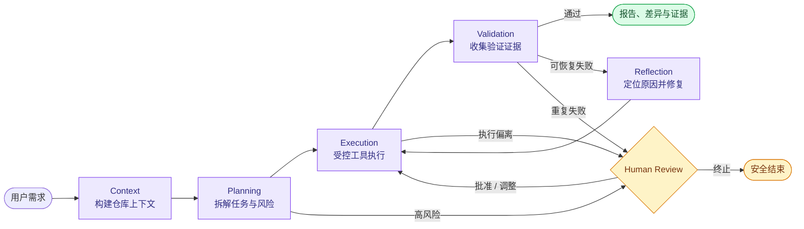

<div align="center">
  

  <h1>CodeAgent</h1>

  <p><strong>面向真实代码仓库、可验证、可恢复的软件工程 Agent</strong></p>
  <p>从需求理解、代码检索和任务规划，到受控执行、自动验证与人工审核，形成完整的工程闭环。</p>

  <p>
    <a href="https://github.com/wee235929-cmyk/Codeagent/actions/workflows/ci.yml"></a>
    <a href="https://github.com/wee235929-cmyk/Codeagent/actions/workflows/security.yml"></a>
    
    
    
    <a href="LICENSE"></a>
  </p>

  <p>
    <a href="#quick-start">快速开始</a> ·
    <a href="#features">核心能力</a> ·
    <a href="#workflow">运行闭环</a> ·
    <a href="#architecture">系统架构</a> ·
    <a href="#development">开发验证</a>
  </p>
</div>

> [!IMPORTANT]
> CodeAgent 当前处于 `0.1.0` 开发阶段。请优先在测试仓库或独立 Git 分支中运行，并在合并前人工检查代码差异与验证结果。

## 项目定位

CodeAgent 不是一次性的代码生成器，而是一个 **Web-first 软件工程 Agent**。它围绕真实仓库执行完整任务：理解需求、建立上下文、制定计划、修改代码、运行验证，并把过程事件、最终差异和验证证据呈现给用户。

<table>
  <tr>
    <td width="25%" align="center"><strong>🧭 显式规划</strong><br /><sub>先理解影响范围，再生成可执行步骤</sub></td>
    <td width="25%" align="center"><strong>🧠 仓库感知</strong><br /><sub>融合关键词、AST、依赖与语义检索</sub></td>
    <td width="25%" align="center"><strong>✅ 证据驱动</strong><br /><sub>以语法、静态分析和测试结果判定完成</sub></td>
    <td width="25%" align="center"><strong>🛡️ 全程可控</strong><br /><sub>沙箱、检查点与人工审核共同约束执行</sub></td>
  </tr>
</table>

<a id="features"></a>

## 核心能力

| 模块 | 工程能力 |
| --- | --- |
| **有状态工作流** | 基于 LangGraph 编排上下文、规划、执行、验证、反思与人工审核，支持条件路由、修复循环和 Checkpoint 恢复 |
| **上下文引擎** | 组合受限 `ripgrep`、Tree-sitter 符号/依赖分析、LanceDB 语义检索，并在 Token 预算内压缩与排序证据 |
| **受控工具系统** | 提供文件、搜索、Git、符号导航、诊断和终端工具；限制项目根目录、命令范围、执行时间与输出大小 |
| **验证闭环** | 按语法检查、静态分析、测试与运行时验证逐层收集证据；失败时反思并重试，超出边界则转人工审核 |
| **实时交互** | 通过 Redis 保存事件历史并使用 Pub/Sub + WebSocket 推送规划、工具调用、验证、恢复和审核事件 |
| **记忆与扩展** | 支持会话/项目记忆、`AGENTS.md`、项目级 Skills、MCP stdio / Streamable HTTP 与 A2A 1.0 |
| **模型可靠性** | 通过 LiteLLM 接入多提供商，支持 L1/L2/L3 分级路由、分类重试、限流退避、熔断与备用模型 |
| **多入口交互** | 提供 React Web UI、CLI、REST API、WebSocket，以及可选的分布式任务执行方式 |

<a id="workflow"></a>

## 运行闭环



每次任务都运行在隔离的可写工作区中。成功不以模型声称“已完成”为准，而以仓库差异和验证证据为准；高风险计划、执行偏离或重复失败会暂停并等待人工决策。

<a id="quick-start"></a>

## 快速开始

### 环境要求

当前仓库在 Windows 上以 [Harness](scripts/harness.ps1) 作为统一开发入口：

| 依赖 | 要求 | 用途 |
| --- | --- | --- |
| Windows | Windows 10/11 + PowerShell | 运行 Harness |
| Python | 3.12+ | 后端、Agent 与测试 |
| Node.js | 20+，包含 npm | React 前端 |
| Git | 可用版本 | 仓库操作与差异检查 |
| Docker Desktop | Docker daemon 正常运行 | Redis 与默认执行沙箱 |
| LLM API Key | 真实 Agent 任务需要 | 调用配置的模型服务 |

### 1. 克隆并配置

```powershell
git clone https://github.com/wee235929-cmyk/Codeagent.git
Set-Location Codeagent
Copy-Item .env.example .env
```

在 `.env` 中至少确认以下配置：

```dotenv
LLM_API_KEY=your-api-key
LLM_API_BASE=https://api.deepseek.com/v1
LLM_MODEL=deepseek/deepseek-v4-flash
```

模型名称遵循 LiteLLM 格式，也可换成其他兼容提供商。

> [!CAUTION]
> `.env` 已被 Git 忽略，仅用于本地保存密钥。不要把真实密钥写入任务描述、日志、截图或提交记录。

### 2. 安装并启动

```powershell
# 安装由 uv.lock 与 package-lock.json 锁定的依赖
powershell -ExecutionPolicy Bypass -File scripts/harness.ps1 setup

# 检查 Git、Python、Node、Docker 和上下文检索能力
powershell -ExecutionPolicy Bypass -File scripts/harness.ps1 doctor

# 首次运行真实 Agent 前构建默认沙箱镜像
powershell -ExecutionPolicy Bypass -File scripts/harness.ps1 sandbox-build

# 启动 Redis、FastAPI 与 Vite（本地默认使用 inline runner）
powershell -ExecutionPolicy Bypass -File scripts/harness.ps1 up
```

| 服务 | 地址 |
| --- | --- |
| Web UI | <http://127.0.0.1:5173> |
| REST API | <http://127.0.0.1:8000> |
| Swagger / OpenAPI | <http://127.0.0.1:8000/docs> |
| 健康检查 | <http://127.0.0.1:8000/health> |
| Prometheus 指标 | <http://127.0.0.1:8000/metrics> |

### 3. 创建第一个任务

打开 Web UI，在对话框中输入边界清晰、结果可验证的需求，例如：

```text
修复登录接口在 token 过期时返回 500 的问题，补充回归测试，并运行相关测试验证。
```

任务运行期间可以观察计划、检索、工具调用、验证和人工审核事件；完成后请检查最终报告与 Git 差异。

<details>
<summary><strong>常用生命周期命令</strong></summary>

```powershell
powershell -ExecutionPolicy Bypass -File scripts/harness.ps1 status
powershell -ExecutionPolicy Bypass -File scripts/harness.ps1 logs api
powershell -ExecutionPolicy Bypass -File scripts/harness.ps1 down
```

运行时 PID 与日志保存在 `.harness/`，该目录不应提交。
</details>

## CLI

Web UI 是主要交互入口，也可以直接从命令行执行任务：

```powershell
# 在指定项目中执行任务，默认保留人工审核
uv run codeagent ask "修复订单总价计算错误并添加测试" --project D:\path\to\project

# 查看详细执行过程
uv run codeagent ask "解释认证模块的调用链" --project . --verbose

# 输出便于脚本消费的 JSON
uv run codeagent ask "检查潜在空指针问题" --project . --json --no-color
```

`--auto` 会跳过交互确认，只应在隔离环境和明确任务范围内使用。运行 `uv run codeagent ask --help` 可查看完整参数。

## 配置

完整模板位于 [.env.example](.env.example)。常用配置如下：

| 配置项 | 作用 |
| --- | --- |
| `LLM_API_KEY` / `LLM_API_BASE` / `LLM_MODEL` | 主模型凭据、地址与 LiteLLM 模型标识 |
| `MODEL_ROUTING_MODE` | 三级模型路由模式：`off` / `shadow` / `on` |
| `USE_INLINE_RUNNER` | 在 API 进程内执行任务；本地开发建议保持 `true` |
| `REDIS_URL` | 任务状态、事件历史与实时消息 |
| `SANDBOX_ENABLED` / `SANDBOX_TIMEOUT` | Docker 隔离执行与超时限制 |
| `CONTEXT_*` | 上下文模式、Token 预算、AST 与语义索引策略 |
| `MAX_LLM_CALLS_PER_TASK` / `MAX_TOKENS_PER_TASK` | 单任务调用次数与 Token 总预算 |
| `MEMORY_ENABLED` / `SKILLS_ENABLED` / `MCP_ENABLED` | 项目记忆、Skills 与 MCP 开关 |
| `CHECKPOINT_ENABLED` | LangGraph SQLite 检查点开关 |
| `API_KEYS` / `RATE_LIMIT_RPM` | REST API 访问控制与限流 |

本地开发默认使用 `USE_INLINE_RUNNER=true`，无需启动 Celery；仅在部署或专门验证分布式执行时启用 worker。大型仓库的 LanceDB 索引可在后台构建，期间仍可使用文件树、`ripgrep`、Tree-sitter 和受限文件读取。

## MCP 与项目级扩展

```powershell
Copy-Item .codeagent/mcp.example.json .codeagent/mcp.json
uv run codeagent mcp doctor --project .
```

凭据应放在已忽略的 `.codeagent/mcp.secrets.json`，或通过允许的环境变量传入。项目还会自动发现：

- 根目录 `AGENTS.md`：定义仓库级开发约束；
- `.codeagent/skills/*/SKILL.md`：定义项目专用流程与知识；
- A2A 1.0 配置：按独立开关启用入站服务与出站委派。

MCP 的检索、排序与生命周期设计见 [工具检索架构](docs/tool-retrieval-architecture.md)。

<a id="architecture"></a>

## 系统架构


| 层级 | 主要技术 |
| --- | --- |
| Agent / 编排 | Python 3.12、LangGraph、LiteLLM、Pydantic |
| 上下文 | ripgrep、Tree-sitter、LanceDB、sentence-transformers、NetworkX |
| API / 实时通信 | FastAPI、Uvicorn、WebSocket、Redis |
| 前端 | React 19、TypeScript、Vite 8、Tailwind CSS |
| 执行与持久化 | Inline runner、Celery、Docker、SQLite |
| 质量与可观测性 | Pytest、Vitest、Ruff、Mypy、Bandit、Prometheus、OpenTelemetry |

<details>
<summary><strong>查看项目结构</strong></summary>

```text
Codeagent/
├── codeagent/
│   ├── interaction/       # FastAPI、WebSocket 与 CLI 边界
│   ├── orchestration/     # LangGraph 工作流、节点与运行时
│   ├── context_engine/    # 文件树、符号、依赖和语义上下文
│   ├── tools/             # 文件、搜索、Git、终端与 MCP 工具
│   ├── gateway/           # Agent、模型、工具、上下文和验证抽象
│   ├── memory/            # 会话、项目记忆与策略提取
│   ├── validation/        # 语法、静态分析、测试与运行时验证
│   ├── sandbox/           # Docker 执行器
│   ├── benchmarks/        # SWE 任务准备与预测导出
│   └── a2a/               # A2A 1.0 互操作能力
├── frontend/              # React / Vite 单页应用
├── tests/                 # unit、integration、e2e 与 benchmark 测试
├── evals/                 # SWE smoke 与 verified 数据清单
├── scripts/               # Windows Harness 与评测辅助脚本
└── docs/                  # 工程设计文档
```
</details>

<a id="development"></a>

## 开发与验证

所有标准操作均通过 Harness 执行。迭代时先运行最小相关测试，交付前运行完整确定性测试。

| 命令 | 检查内容 | 调用 LLM |
| --- | --- | :---: |
| `check` | Python 编译、前端 lint/build、Compose 配置 | 否 |
| `core` | Agent 主链路、API、工具、沙箱与前端组件 | 否 |
| `test` | 完整 Python unit 与前端组件测试 | 否 |
| `lint` / `typecheck` | Ruff、ESLint、Mypy 与 TypeScript | 否 |
| `integration` | 集成测试，部分能力需要 Docker/网络 | 否 |
| `eval` | 确定性的 CodeAgent Core Eval 代理测试 | 否 |
| `security` | Bandit 与 npm 高危依赖审计 | 否 |
| `verify` | 依次运行 `doctor`、`check`、`test`、`eval`、`security` | 否 |

```powershell
powershell -ExecutionPolicy Bypass -File scripts/harness.ps1 check
powershell -ExecutionPolicy Bypass -File scripts/harness.ps1 test
powershell -ExecutionPolicy Bypass -File scripts/harness.ps1 verify
```

> [!NOTE]
> `eval` 只包含确定性代理测试，不代表官方模型基准成绩。LLM-backed E2E 不会被 `setup` 或 `verify` 静默触发，因为它会消耗真实 API 配额。

### SWE-bench 边界

仓库包含 SWE-bench Lite smoke catalog，用于可重复的产品冒烟与推理实验；只有上游 SWE-bench Docker Harness 才能确认实例是否真正 resolved。

```powershell
# 以下命令不调用 LLM
powershell -ExecutionPolicy Bypass -File scripts/harness.ps1 swe-list
powershell -ExecutionPolicy Bypass -File scripts/harness.ps1 swe-status
powershell -ExecutionPolicy Bypass -File scripts/harness.ps1 swe-export

# 真实推理会产生 API 费用，必须显式确认
$env:CONFIRM_LLM_API_COST='true'
powershell -ExecutionPolicy Bypass -File scripts/harness.ps1 swe-infer smoke-5
```

## API 与安全

REST API 基础路径为 `/api/v1`，任务事件流位于 `/api/v1/tasks/{task_id}/stream`。启动服务后可在 <http://127.0.0.1:8000/docs> 查看当前 OpenAPI 定义。

安全边界包括：

- 文件工具将路径限制在目标项目根目录中；
- 终端执行具备命令检查、工作目录约束、超时和输出上限；
- 默认配置启用 Docker 沙箱，高风险计划与重复失败可转人工审核；
- 模型、MCP 与 API 密钥不应进入仓库、任务文本或公开日志；
- 沙箱用于降低误操作风险，不能替代最小权限、系统隔离和人工代码审查。

## 常见问题

<details>
<summary><strong><code>doctor</code> 提示 Docker daemon 不可用</strong></summary>

启动 Docker Desktop，等待引擎就绪后重新运行 `doctor`。当前 Harness 使用 Docker 启动 Redis，默认 Agent 命令执行也依赖本地沙箱镜像。
</details>

<details>
<summary><strong>页面可以打开，但任务无法开始</strong></summary>

依次检查 `harness.ps1 status`、`harness.ps1 logs api` 和 `.env`。真实任务需要有效且相互匹配的 `LLM_API_KEY`、`LLM_API_BASE`、`LLM_MODEL`，Redis 也必须正常运行。
</details>

<details>
<summary><strong>本地开发需要 Celery 吗？</strong></summary>

不需要。默认 `USE_INLINE_RUNNER=true`，Harness 的 `up` 不会启动 Celery；只有验证分布式执行或部署 worker 时才需要。
</details>

<details>
<summary><strong>如何清理遗留沙箱容器？</strong></summary>

运行 `powershell -ExecutionPolicy Bypass -File scripts/harness.ps1 sandbox-clean`。该命令仅清理 CodeAgent 管理的沙箱容器及兼容旧容器。
</details>

## 参与贡献

欢迎提交 Issue 和 Pull Request。请在独立分支中开发，为新行为补充最小有效测试，并在提交前运行：

```powershell
powershell -ExecutionPolicy Bypass -File scripts/harness.ps1 test
```

若修改 REST / WebSocket 结构，请同步更新文档、前端类型和测试。详细约定见 [CONTRIBUTING.md](CONTRIBUTING.md)。

## 开源许可

本项目基于 [Apache License 2.0](LICENSE) 开源。

---

<div align="center">
  <sub>如果 CodeAgent 对你有帮助，欢迎提交反馈、参与改进，或在 GitHub 上点一个 Star ⭐</sub>
</div>
